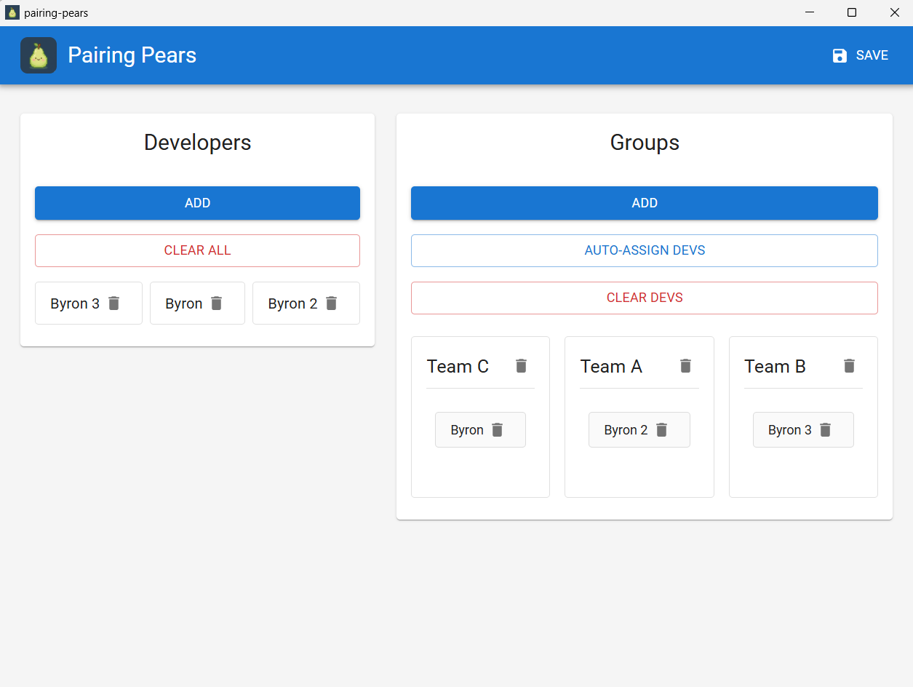

# PairingPears

A simple desktop application for randomly pairing programmers into different boxes/teams. This is how it looks like in action:



## Prerequisites

Before you can run this project, you need to have the following installed:

- **Go** (version 1.18 or later) - [Download here](https://golang.org/dl/)
- **Node.js** (version 15 or later) - [Download here](https://nodejs.org/)
- **Wails CLI** - Install with: `go install github.com/wailsapp/wails/v2/cmd/wails@latest`

### Requirements

**Windows:**
- WebView2 (usually pre-installed on Windows 10/11)

## Getting Started

### 1. Install Dependencies

After cloning the project, install the frontend dependencies:

```bash
cd PairingPears
npm install
```

### 2. Run in Development Mode

```bash
wails dev
```

### 3. Build for Production

```bash
wails build
```

## Project Structure

PairingPears/
├── frontend/          # React application
│   ├── src/          # React components and code
│   └── package.json  # Frontend dependencies
├── build/            # Compiled binaries (created after build)
│   └── bin/         # Your executable will be here
├── app.go           # Go backend - add your functions here
├── main.go          # Application entry point
└── wails.json       # Wails project configuration

## How It Works

Frontend (React): Located in the frontend/ directory. This is where you build your UI.
Backend (Go): Functions in app.go can be called from your React code.
Calling Go from React: Import generated bindings from wailsjs/go/main/App to call your Go functions.